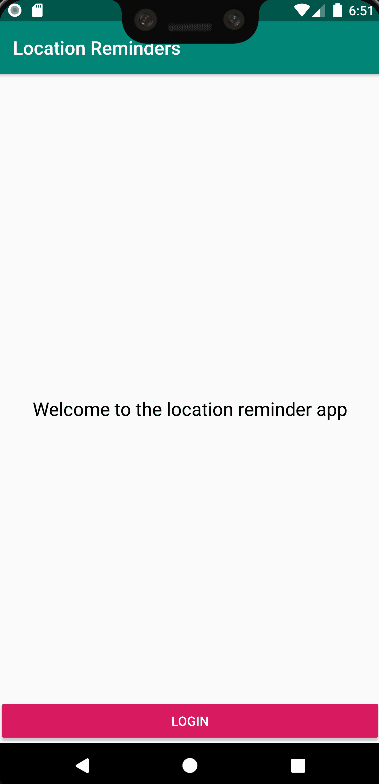

# Android NanoDegree Location Reminders

This is based on the starter code from [here](https://github.com/udacity/nd940-android-kotlin-c4-starter).

This project is part of the [Andrlid Kotlin Developer Nanodegree](https://vtsen.hashnode.dev/is-it-worth-to-pay-for-android-kotlin-developer-nanodegree) from Udacity. For details, please refer to the following:
- [Course 4 Project: Build a Location Reminder App](https://vtsen.hashnode.dev/android-kotlin-developer-nanodegree-projects-review#heading-course-4-project-build-a-location-reminder-app)

## Requirements
- Android Studio Bumblebee or later
- You need to setup your own `google-services.json` and replace the existing one in the `app` folder directory.

### Steps to Setup google-services.json
1. Go to https://console.firebase.google.com/
2. Setup Firebase project 
3. Register app with Firebase
4. Add sign-in provider (email and google) for authentication
5. Download `google-services.json` to `app` folder directory

You need to setup your own `Google MAP API Key` and update the [google_maps.api.xml](https://github.com/vinchamp77/Android_NanoDegree_Location_Reminders/blob/master/app/src/debug/res/values/google_maps_api.xml).

### Steps to Setup Google MAP API Key
1. Go to https://console.cloud.google.com/
2. Select the Firebase project that you created previously
3. Enable Maps SDK in API & Services
4. Setup API usage restriction to your app only (optional)
5. In API & Services, credentials, create credentials to get the API KEY
6. Update your API Key in [google_maps.api.xml](https://github.com/vinchamp77/Android_NanoDegree_Location_Reminders/blob/master/app/src/debug/res/values/google_maps_api.xml).

> **Note**: Instructions here are high-level. You need to do a bit of due diligence to setup these API Keys.
